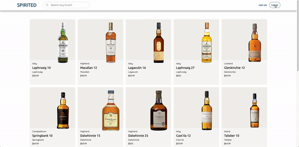
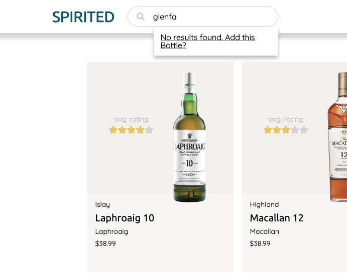
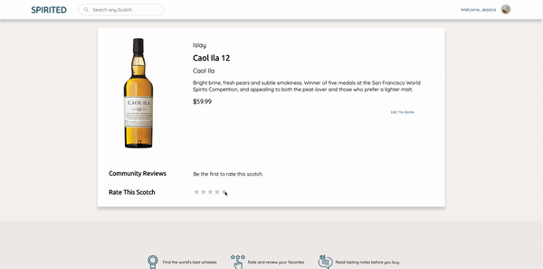

<header style="display: flex; align-items: center;">
  
  <h1>SPIRITED</h1>
</header>

Welcome to **[Spirited](https://spirited-app.herokuapp.com/#/)**, built for Single Malt Scotch lovers using Ruby on Rails and React. Users can rate and review their favorite whiskies, and search our database to discover new drams.

<br>

## Table of Contents
1. [Languages and Technologies](#languages-and-technologies)

2. [Functionality and Features](#functionality-and-features)
    * User Authentication
    * Explore Our Whiskies
    * Add and Review Your Favorite Malts
3. [Background and Implementation Timeline](#background-and-implementation-timeline)
    * Initial Sprint
    * Planned Expansions

<br>
<h2><a id="languages-and-technologies" href="#languages-and-technologies">
  Languages and Technologies
</a></h2>

* `React` for component management and rapid single-page app rendering
* `Redux` to manage the store and maintain a single source of truth for all React components
* `Javascript` as the frontend language, and to manage asynchronous operations
* `Ruby on Rails` acts as the backend API, including controllers models, and jbuilder views
* `Webpack` for bundling scripts into a single source
* `Postgresql` as a database


<br>
<h2><a id="languages-and-technologies" href="#languages-and-technologies">
  Languages and Technologies
</a></h2>

* `React` for component management and rapid single-page app rendering
* `Redux` to manage the store and maintain a single source of truth for all React components
* `Javascript` as the frontend language, and to manage asynchronous operations
* `Ruby on Rails` acts as the backend API, including controllers models, and jbuilder views
* `Webpack` for bundling scripts into a single source
* `Postgresql` as a database

<br>   
<h2><a id ="functionality-and-features" href="#functionality-and-features">
  Functionality and Features
</a></h2>


### **User Authentication**
Spirited takes security seriously, and new users can register knowing their password will be securely encrypted.

Once logged in, registered users are strapped to the window, as seen in the code snippet below, so they're spared the hassel of signing on every visit unless they've explicitly signed out.

```
<% if logged_in? %>
  <script type="text/javascript">
    window.currentUser = <%= 
      render('api/users/user.json.jbuilder', user: current_user).html_safe
    %>
  </script>
<% end %>
```
<br>



<br>

### **Straightforward Navigation**
All visitors to Spirited can browse our collection of single malts, visit individual bottle pages, and read reviews from other users. Try searching the Spirited database for that bottle you've been meaning to try, and a custom debounced search handles retrieving results from the database.
```
this.debouncedSearch = this._debounce(this.fetchSearchResults, 400)
  
...

handleChange(e) {
  this.showResults();
  this.setState({ query: e.target.value }, 
  () => {
    if (this.state.query.length > 0) {
      this.debouncedSearch(this.state);
    } else {
      this.resetSearchState()
    }
  })
}
```
<br>
See the scotch you want? You can navigate directly to the page to peruse our community's tasting notes. Can't find what you're looking for? You'll be invited in the search results to add a new bottle to our growing collection.


<br>

### **Bottle and Review CRUD Functionality**
Registered users can add new bottles to the site inventory, and also edit or remove bottles they've created. Bottles must be added to a verfied distillery, and we map that to the region accordingly.

Signed-in users can also also add a review alongside a 1- to 5-star rating from any individual bottle page in a hidden form that toggles into visibility using the code snippet below. Users trying to review the same expression twice will be invited to modify their existing review, and you're always able to update or remove a previous review.

```
handleSubmit(e) {
    e.preventDefault();

    const formData = new FormData();
    formData.append('bottle[name]', this.state.name);
    formData.append('bottle[description]', this.state.description);
    formData.append('bottle[distillery_id]', this.state.distillery_id);
    formData.append('bottle[age]', this.state.age);
    formData.append('bottle[release_year]', this.state.release_year);
    formData.append('bottle[price]', this.state.price);

    if (this.state.photoFile) {
      formData.append('bottle[photo]', this.state.photoFile);
    }

    this.props.formAction(formData, this.props.bottleId)
      .then((action) => this.props.history.push(`/bottles/${action.payload.bottle.id}`));
  }
```



<br>
<h2><a id="background-and-implementation-timeline" href="#background-and-implementation-timeline">
  Background and Implementation Timeline
</a></h2>

Spirited was developed as an App Academy student project over a 10-day sprint, using Rails as a backend API and React with Redux for the frontend. The design is inspired by Vivino.com, a popular wine-rating app, with a streamlined user interface and seamless backend data manipulation.

**Initial Sprint:**

1. User Authentication (1.5 days)
2. Bottles CRUD (2 days)
3. User profile (1 Day)
4. Ratings and Reviews CRUD (2 days)
5. Homepage Filtering (2 days)
6. Production README (1 Day)

**Completed Expansions:**

7. Average bottle rating displayed on homepage
8. Add default 'Add this bottle?' result when no search results
9. Pages for distilleries

**Planned Expansions:**

10. Pages for regions
11. Secondary navigation bar with dropdowns for distillery and region pages
12. User ability to crop photos on upload 

